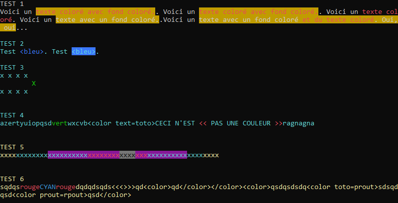

# Notes

## But

**Colorer du texte** affiché en **console .NET 6** en utilisant une structure de **langage de balise**. Les balises de couleur sont **imbriquables**. Les deux modes d'écriture `Write()` et `WriteLine()` sont disponibles.

Exemples :
```
Voici un <color text=Red background=DarkYellow>texte coloré avec fond coloré.</color>.
```
```
Voici un <color background=DarkYellow text=Red>texte coloré avec fond coloré.</color>.
```
```
Voici un <color text=Red>texte coloré</color>.
```
```
Voici un <color background=DarkYellow>texte avec un fond coloré.</color>.
```
```
Voici un <color background=DarkYellow>texte avec un fond coloré <color text=Red>et du texte coloré</color>. Oui, oui</color>...
```

## Usage

L'**espace de nom** du projet dans cette solution est `ColoredConsole.ColoredConsole` et on l'appelle dans le fichier *Program.cs* de la manière suivante.
```
using ColoredConsole.ColoredConsole;
```

Le programme prend la forme d'une **classe statique** `Colored` qui présente deux méthodes envoyant les données dans la **sortie standard** (`Console.Out`) : 
- `Write()` : écrire des **caractères dans le flux de texte**.
- `WriteLine()` : écrire des caractères avec un ajout automatique de caractère de terminaison pour former une **ligne de texte**. 
```
Colored.WriteLine("...");
```
```
Colored.Write("...");
```

Pour son fonctionnement, cette classe a besoin d'une autre classe nommée `Colors` qui présente  **deux champs publics** du type C# `ConsoleColor`, l'un pour le *foreground*, l'autre pour le *background*. Cette classe propose également **deux méthodes publiques** pour **récupérer les couleurs actuelles** de la console et pour **appliquer à la console les couleurs conservées dans les champs**.

Le programme part des couleurs **actuellement utilisées** par la Console et **y revient** une fois terminé. Par conséquent, il est compatible avec l'usage des propriétés .NET `Console.ForegroundColor` et `Console.BackgroundColor`.

La **documentation** des champs, classes ou fonctions est intégrée et apparaît en **IntelliSense** dans **Visual Studio**.

## Exemples

Voici quelques tests et leur résultat dans la capture d'écran suivante.
```csharp
Console.WriteLine("TEST 1");
Colored.Write("Voici un <color text=Red background=DarkYellow>texte coloré avec fond coloré.</color>. ");
Colored.Write("Voici un <color background=DarkYellow text=Red>texte coloré avec fond coloré.</color>. ");
Colored.Write("Voici un <color text=Red>texte coloré</color>. ");
Colored.Write("Voici un <color background=DarkYellow>texte avec un fond coloré.</color>.");
Colored.Write("Voici un <color background=DarkYellow>texte avec un fond coloré <color text=Red>et du texte coloré</color>. Oui, oui</color>...\n");
			
Console.ForegroundColor = ConsoleColor.Cyan;
		
Console.WriteLine("\nTEST 2");
Colored.Write("Test <color text=Blue><bleu></color>. ");
Colored.Write("Test <color background=Blue><bleu></color>.\n");


Console.WriteLine("\nTEST 3");
Colored.WriteLine("x x x x <color text=Green>\n\tX</color>\nx x x x\n");

Console.WriteLine("\nTEST 4");
Colored.WriteLine("azertyuiopqsd<color text=Green>vert</color>wxcvb<color text=toto>CECI N'EST <color text=Red><<</color> PAS UNE COULEUR <color text=Red>>></color>ragnagna\n");

Console.ForegroundColor = ConsoleColor.Yellow;
			
Console.WriteLine("\nTEST 5");
Colored.WriteLine("xxxx<color text=Cyan>xxxxxxxx<color background=DarkMagenta>xxxxxxxxxx<color text=Red>xxxxxxxx<color background=DarkGray text=Black>xxxx</color>xxx</color>xxxxxxxxxx</color>xxxx</color>xxxx\n");

Console.WriteLine("\nTEST 6");
Colored.WriteLine("sqdqs<color text=Red>rouge<color text=DarkCyan text=Blue>CYAN</color>rouge</color>dqdqdsqds<<<>>>qd<color>qd</color></color><color>qsdqsdsdq<color toto=prout>sdsqdqsd<color prout=rpout>qsd</color>");
```


## Explorations de chaîne

L'exploration des chaînes est faite avec des ***regular expressions***. Pour composer ces expressions, j'ai utilisé l'outil en ligne [RegExR](https://regexr.com).

L'ensemble du traitement est réalisé avec une seule boucle `for`. On pourra sans doute encore optimiser et factoriser.

## Recherches 

Pour mes recherches, j'ai principalement utilisé **Google** pour obtenir des résultats de **StackOverflow**. Cette plateforme d'échange entre développeurs et développeuses me permet de découvrir des approches de résolution de problème auxquelles je peux ne pas avoir pensé ou bien des solutions techniques précises. 

J'ai utilisé les mots-clés suivants.
- c# regex create array html tags
- c# regex get html attribute
- c# regex get substring
- regex not
- regex tag with attributes

Ces pages de **StackOverflow** m'ont été utiles à différents niveaux.
- [regex-to-match-html-tags-with-specific-attributes](https://stackoverflow.com/questions/9008430/regex-to-match-html-tags-with-specific-attributes)
- [regular-expression-for-extracting-tag-attributes](https://stackoverflow.com/questions/317053/regular-expression-for-extracting-tag-attributes)
- [regex-not-operator](https://stackoverflow.com/questions/7317043/regex-not-operator)
- [a-regular-expression-to-exclude-a-word-string](https://stackoverflow.com/questions/2078915/a-regular-expression-to-exclude-a-word-string)
- [regex-find-text-between-tags-c-sharp](https://stackoverflow.com/questions/20078741/regex-find-text-between-tags-c-sharp)
- [how-to-match-multiple-occurrences-of-a-substring](https://stackoverflow.com/questions/7041308/how-to-match-multiple-occurrences-of-a-substring)
- [regex-to-extract-attribute-value](https://stackoverflow.com/questions/5526094/regex-to-extract-attribute-value)
- [split-string-to-array-from-text-and-html-tag](https://stackoverflow.com/questions/29139320/split-string-to-array-from-text-and-html-tag)

Je fais des recherches concernant **C#** (`Console.Out` par exemple) : 
- à partir de la **documentation de Microsoft**, par exemple en appuyant sur `F1` après avoir sélectionné un terme dans le code, ou bien dans mon navigateur **Firefox** préféré à partir de la page [MSDN Learn .NET API](https://learn.microsoft.com/fr-fr/dotnet/api/) ou depuis des **liens issus de recherche**,
- à partir des ***source links*** en appuyant sur `F12` après avoir sélectionné un terme dans le code.
